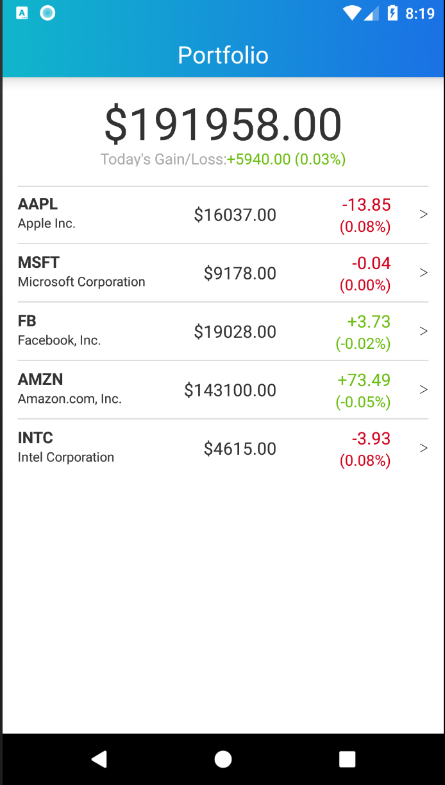
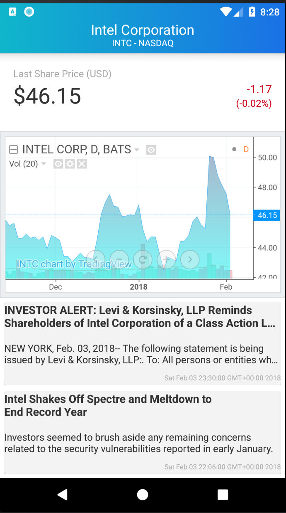

# Portfolio Application

This application allows you to view the details of your portfolio. It includes your open positions in various instruments.

The first page displays each of your open positions valuation and the total value of your portfolio. This is shown below:

You can swipe down on the list to fetch latest pricing for each of your open positions. 
(Unfortunately, since the application is using Free Quandl API the prices fetched are the closing prices of the previous business day)

Once you click on an individual position this will open the a detailed information about the particular instrument (in this case, stock) showing its last price and a detailed chart of its price movements within the last couple of months. The chart has a navigation control making it very flexible to display prices over different periods. Underneath the chart are some of the headlines related to this particular stock, with the most recent headlines first. If you wish to find out more detail about a particular news item, just click on it and it will open up in your external browser.

